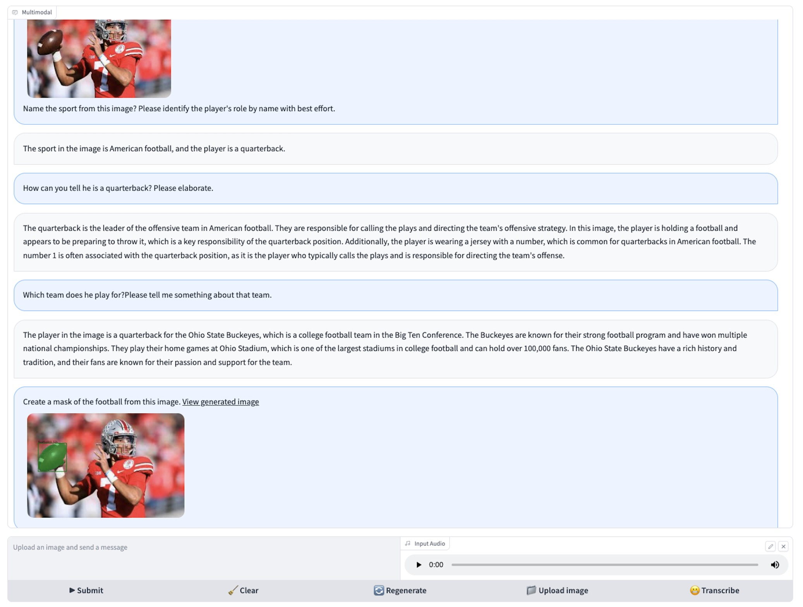

# Dialogue Guided Visual Langauge Processing

[Blog Post]() [Demo](https://radaide.cavatar.info:7863)

Welsome to the open source implementation of DGVLP, a multimodal visual language learning  that encompasses language intelligence, vision understanding and processing. 



# Installation
To install the packages in an existing environment, run 
```
pip install -r requirements.txt
```

# Configuration Options

## Firewall

Allow ports 7863 and 8080 on server node an port 8080-8083 from TGI inference nodes.

## Enable SSL cert and pem

Generate your TLS/SSL certificate and signed by a publicly trusted certificate authority (CA). You can elect to self-sign a temporary certificate pair.


## File server
Python's http.server extended to include a file upload page.
```
python -m uploadserver 8080 --bind 0.0.0.0 --directory "/tmp/gradio"
```

## Build TGI docker image

```
docker nuild . -f Dockerfile -t 'tgi1.03'
```

## Llama v2 text generation inference

```
docker_rt_name="meta-llama/Llama-2-7b-chat-hf'
docker_image_name="tgi1.03"
docker run --gpus="1,2,3,4" --shm-size 20g -p 8080:80 --restart unless-stopped --name ${docker_rt_name} ${docker_image_name} --model-id ${llm_model}
```

## IDEFICS inference

```
docker_rt_name="huggingfacm4/idefics-9b-instruct'
docker_image_name="tgi1.03"
docker run --gpus="1,2,3,4" --shm-size 20g -p 8081:80 --restart unless-stopped --name ${docker_rt_name} ${docker_image_name} --model-id ${llm_model}
```

### Test multimodal inference API using Curl

```
# Test the API using curl
curl -X 'POST' \  'http://<hostname_or_ip>:8081/' \  
    -H 'accept: application/json' \  
    -H 'Content-Type: application/json' \  
    -d '{  
        "inputs": "User:Which device produced this image? Please explain the main clinical purpose of such image?Can you write a radiology report based on this image?<end_of_utterance>", \
        "parameters": {    
            "best_of": 1,    "decoder_input_details": true,   \
            "details": true,    "do_sample": true,    "max_new_tokens": 20,  \
            "repetition_penalty": 1.03,    "return_full_text": false,    \
            "seed": null,    "stop": [      "photographer"    ],    \
            "temperature": 0.5,    "top_k": 10,    "top_p": 0.95,   \
            "truncate": null,    "typical_p": 0.95,    "watermark": true  },  \
        "stream": false \
        }'
```

# Usage

1. Configure file_server using httpd uploadserver. Test file uplaod and download.
2. Enable Llama-2-7b-chat-hf with TGI. Verify API access.
3. Enable IDEFICS-9b-instruct with TGI. Verify API access.
4. Prepapre signed SSL key and PEM files.
5. Choose a simple username and passcode to protect your demo site (optional)
6. Launch demo 

```
python app_radaide.py
```


**How to Contribute**
---

1. Clone repo and create a new branch: `$ git checkout https://github.com/alichtman/stronghold -b name_for_new_branch`.
2. Make changes and test
3. Submit Pull Request with comprehensive description of changes


**Acknowledgements**
---

+ [HuggingFaceM4](https://huggingface.co/HuggingFaceM4) for IDEFICS.
+ [Meta Research](https://huggingface.co/meta-llama) for the pre-trained Llama-v2.
+ [IDEA-Research](https://github.com/IDEA-Research/Grounded-Segment-Anything) for the Grounded SAM.
+ [LangChain](https://www.langchain.com/) for LLM task orchastration.
+ [Open Flamingo](https://github.com/mlfoundations/open_flamingo/tree/main) for the pre-trained Open Flamingo model.
+ [Hugging Face](https://huggingface.co/distilbert-base-uncased-finetuned-sst-2-english) for pre-trained LM for multi-class text classificatiodn.
